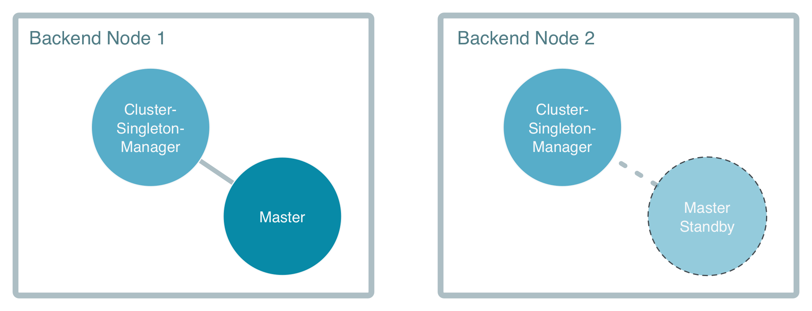

# The Backend Nodes

## The Master singleton

The heart of the solution is the `Master` actor that manages outstanding work, keeps track of available workers,
and notifies registered workers when new work is available.

The [Cluster Singleton](http://doc.akka.io/docs/akka/current/scala/guide/modules.html#cluster-singleton) tool in 
Akka makes sure it only runs on one node within the subset of nodes marked with the role `backend` at any 
given time. It will run on the oldest such node, if that node is removed from the cluster the singleton will be 
started on the new oldest node. 

The tool also allows for interacting with the singleton from any node in the cluster
without explicitly knowing where it runs, this is done through the `ClusterSingletonProxy`.

You can see how the master singleton is started in the method `startSingleton`
in `MasterSingleton`:

@@snip [MasterSingleton.scala]($g8src$/scala/worker/MasterSingleton.scala) { #singleton }

The singleton accepts the `Prop`s of the actual singleton actor, as well as configuration which allows us to decide
that the singleton actors should only run on the nodes with the role `backend`.

To interact with the singleton from any node in the cluster, without explicitly having to figure out where it is running,
we use the `ClusterSingletonProxy`:

@@snip [MasterSingleton.scala]($g8src$/scala/worker/MasterSingleton.scala) { #proxy }

The proxy is similarly configured, with the role where the singleton will be running, and also a path to where in 
the actor tree the singleton will be. The proxy actor itself can then be started anywhere in the actor tree.

In case of the master node crashing and being removed from the cluster another master actor is automatically started 
on a standby node. The master on the standby node takes over the responsibility for outstanding work. Work in progress 
can continue and will be reported to the new master. 

The state of the master is recovered on the standby node in the case of the node being lost through event sourcing. 

An alternative to event sourcing and the singleton master would be to keep track of all jobs in a central database, 
but that is more complicated and not as scalable. In the end of the tutorial we will describe how multiple masters 
can be supported with a small adjustment.

Later we will explore the implementation of the `Master`
actor in depth, but first we will take a look at the frontend and worker that interacts with the master.
