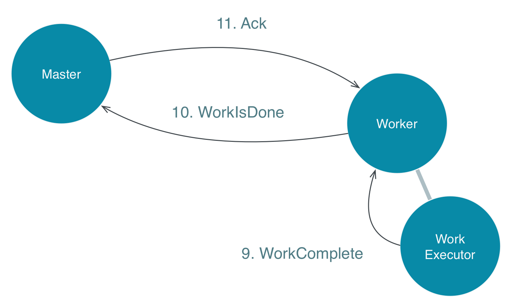
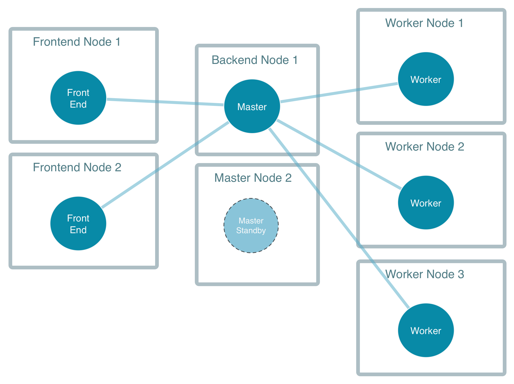

# Akka Distributed Workers

## The Goal

This guide requires familiarity with Actors, if you have no previous experience with 
Actors you should start with [Akka Quickstart with Scala](http://developer.lightbend.com/guides/akka-quickstart-scala/)
which goes through the basics.

Some applications need to distribute work to many machines because one single box
obviously has limited resources. This tutorial will show one way to implement
distributed workers using Akka cluster features.
		
The solution should support:

 * elastic addition/removal of frontend nodes that receives work from clients
 * elastic addition/removal of worker actors and worker nodes
 * each worker hosting one or more workers
 * jobs should not be lost, and if a worker fails, the job should be retried

The design is based on Derek Wyatt's blog post 
[Balancing Workload Across Nodes with Akka 2](http://letitcrash.com/post/29044669086/balancing-workload-across-nodes-with-akka-2) which describes
the advantages of letting the workers pull work from the master instead of pushing work to
the workers. From a bird's eye perspective it looks like this:


Front end nodes post work to a work master, or manager if you will, that in turn distribute the 
work across the available workers.

## A closer look at the Master

The heart of the solution is the `Master` actor that manages outstanding work
and notifies registered workers when new work is available.


The [Cluster Singleton](http://doc.akka.io/docs/akka/current/scala/guide/modules.html#cluster-singleton) tool in 
Akka makes sure it only runs on one node within the subset of nodes
marked with the role `backend` at any given time. It will run on the oldest such node, 
if that node is removed from the cluster the singleton will be started on the new oldest node. 

The tool also allows for interacting with the singleton from any node in the cluster
without explicitly knowing where it runs, this is done through the `ClusterSingletonProxy`.

You can see how the master singleton is started in the method `startBackend`
in <a href="#code/src/main/scala/worker/Main.scala" class="shortcut">Main.scala</a>

Scala
: @@@

@@@


In case of failure of the master node another master actor is automatically started on
a standby node. The master on the standby node takes over the responsibility for
outstanding work. Work in progress can continue and will be reported to the new master.
The state of the master can be re-created on the standby node using event sourcing.
An alternative to event sourcing and the singleton master would be to keep track of all
jobs in a central database, but that is more complicated and not as scalable. In the end
of the tutorial we will describe how multiple masters can be supported with a small adjustment.

The master actor is made available for workers by registering itself
in the <a href="http://doc.akka.io/docs/akka/2.4.0/scala/cluster-client.html"
target="_blank">ClusterReceptionist</a>.

The frontend actor talks to the master actor via the
in the <a href="http://doc.akka.io/docs/akka/2.4.0/scala/distributed-pub-sub.html"
target="_blank">ClusterSingletonProxy</a>.

Later we will explore the implementation of the <a href="#code/src/main/scala/worker/Master.scala" class="shortcut">Master</a>
actor in depth, but first we will take a look at the frontend and worker that interacts with the master.

## Explore the Code - Front End

A typical frontend provides a RESTful API that is used by the clients to submit (POST) jobs.
When the service has accepted the job it returns Created/201 response code to the client.
If it can't accept the job it returns a failure response code and the client has to retry or
discard the job.

In this example the frontend is emulated, for simplicity, by an ordinary actor, see
<a href="#code/src/main/scala/worker/Frontend.scala" class="shortcut">Frontend.scala</a>
and client requests are simulated by the
<a href="#code/src/main/scala/worker/WorkProducer.scala" class="shortcut">WorkProducer.scala</a>.
As you can see the <code>Frontend</code> actor sends the work to the active master via the
<code>ClusterSingletonProxy</code>. It doesn't care about the exact location of the
master. Somewhere in the cluster there should be one master actor running.
The message is sent with <code>ask/?</code> to be able to reply to the client (<code>WorkProducer</code>)
when the job has been accepted or denied by the master.


You can see how a Frontend and WorkProducer actor is started in the method <code>startFrontend</code>
in <a href="#code/src/main/scala/worker/Main.scala" class="shortcut">Main.scala</a>

## Explore the Code - Worker</h2>

You can see how a worker is started in the method <code>startWorker</code>
in <a href="#code/src/main/scala/worker/Main.scala" class="shortcut">Main.scala</a>

Open <a href="#code/src/main/scala/worker/Worker.scala" class="shortcut">Worker.scala</a>.

The worker register itself periodically to the master, see the <code>registerTask</code>.
This has the nice characteristics that master and worker can be started in any order, and
in case of master fail over the worker re-register itself to the new master.


The Frontend actor sends the work to the master actor.


When the worker receives work from the master it delegates the actual processing to
a child actor, <a href="#code/src/main/scala/worker/WorkExecutor.scala" class="shortcut">WorkExecutor</a>,
to keep the worker responsive while executing the work.


## Explore the Code - Master Revisited

Now when we know more about the Worker and Frontend that interacts with the Master it
is time to take a closer look at
<a href="#code/src/main/scala/worker/Master.scala" class="shortcut">Master.scala</a>.

Workers register itself to the master with <code>RegisterWorker</code>. Each worker
has an unique identifier and the master keeps track of the workers, including current
<code>ActorRef</code> (sender of <code>RegisterWorker</code> message) that can be used
for sending notifications to the worker. This <code>ActorRef</code> is not a direct
link to the worker actor, but messages sent to it will be delivered to the worker.
When using the cluster client messages are are tunneled via the receptionist on some
node in the cluster to avoid inbound connections from other cluster nodes to the client.

When the master receives <code>Work</code> from frontend it adds the work item to
the queue of pending work and notifies idle workers with <code>WorkIsReady</code> message.

To be able to restore same state in case of fail over to a standby master actor the
changes (domain events) are stored in an append only transaction log and can be replayed
when standby actor is started.
<a href="http://doc.akka.io/docs/akka/2.4.0/scala/persistence.html" target="_blank">Akka Persistence</a>
is used for that. <a href="#code/src/main/scala/worker/Master.scala" class="shortcut">Master</a> extends
<code>PersistentActor</code> and events are stored in with the calls to the <code>persist</code>
method. When the domain event has been saved successfully the master replies
with an acknowledgement message (<code>Ack</code>) to the frontend.
The master also keeps track of accepted work identifiers to be able to discard duplicates
sent from the frontend.


When a worker receives <code>WorkIsReady</code> it sends back <code>WorkerRequestsWork</code>
to the master, which hands out the work, if any, to the worker. The master keeps track of that
the worker is busy and expect a result within a deadline. For long running jobs the worker
could send progress messages, but that is not implemented in the example.


When the worker sends <code>WorkIsDone</code> the master updates its state of the worker
and sends acknowledgement back to the worker. This message must also be idempotent as the worker will
re-send if it doesn't receive the acknowledgement.



## Summary

The <a href="#code/src/main/scala/worker/Master.scala" class="shortcut">Master</a> actor
is a <a href="http://doc.akka.io/docs/akka/2.4.0/scala/cluster-singleton.html"
target="_blank">Cluster Singleton</a> and register itself in the 
<a href="http://doc.akka.io/docs/akka/2.4.0/scala/cluster-client.html" target="_blank">Cluster Receptionist</a>.
The <code>Master</code> is using 
<a href="http://doc.akka.io/docs/akka/2.4.0/scala/persistence.html" target="_blank">Akka Persistence</a>
to store incoming jobs and state.

The <a href="#code/src/main/scala/worker/Frontend.scala" class="shortcut">Frontend</a> actor send work
to the master via the <code>ClusterSingletonProxy</code>.

The <a href="#code/src/main/scala/worker/Worker.scala" class="shortcut">Worker</a> communicate with the
cluster and its master with the <a href="http://doc.akka.io/docs/akka/2.4.0/scala/cluster-client.html"
target="_blank">Cluster Client</a>.



## Run the Application

Open the <a href="#run" class="shortcut">Run</a> tab and select <code>worker.Main</code> followed
by Restart. On the left-hand side we can see the console output, which is logging output
from nodes joining the cluster, the simulated work and results.

The <a href="#code/src/main/scala/worker/Main.scala" class="shortcut">worker.Main</a>
starts three actor systems in the same JVM process. It can be more
interesting to run them in separate processes. <b>Stop</b> the application in the
<a href="#run" class="shortcut">Run</a> tab and then open three terminal windows.

In the first terminal window, start the first seed node with the following command:

```bash
sbt "runMain worker.Main 2551"
```

2551 corresponds to the port of the first seed-nodes element in the configuration. In the log
output you see that the cluster node has been started and changed status to 'Up'.

In the second terminal window, start the frontend node with the following command:

```bash
sbt "runMain worker.Main 3001"		
```

3001 is to the port of the node. In the log output you see that the cluster node has been started
and joins the 2551 node and becomes a member of the cluster. Its status changed to 'Up'.

Switch over to the first terminal window and see in the log output that the member joined.
So far, no <code>Worker</code> has not been started, i.e. jobs are produced and accepted but
not processed.

In the third terminal window, start a worker node with the following command:

```bash
sbt "runMain worker.Main 0"
```

Now you don't need to specify the port number, 0 means that it will use a random available port.
This worker node is not part of the cluster, but it connects to one of the configured cluster
nodes via the <code>ClusterClient</code>. Look at the log output in the different terminal
windows. In the second window (frontend) you should see that the produced jobs are processed
and logged as <code>"Consumed result"</code>.

Take a look at the logging that is done in 
<a href="#code/src/main/scala/worker/WorkProducer.scala" class="shortcut">WorkProducer.scala</a>,
<a href="#code/src/main/scala/worker/Master.scala" class="shortcut">Master</a>
and <a href="#code/src/main/scala/worker/Worker.scala" class="shortcut">Worker.scala</a>.
Identify the corresponding log entries in the 3 terminal windows.

Shutdown the worker node (third terminal window) with <code>ctrl-c</code>.
Observe how the <code>"Consumed result"</code> logs in the frontend node (second terminal window)
stops. Start the worker node again.

```bash
sbt "runMain worker.Main 0"
```

You can also start more such worker nodes in new terminal windows.

You can start more cluster backend nodes using port numbers between 2000-2999:

```bash
sbt "runMain worker.Main 2552"
```

You can start more cluster frontend nodes using port numbers between 3000-3999:

```
sbt "runMain worker.Main 3002"		
```

Note that this sample runs the 
<a href="http://doc.akka.io/docs/akka/2.4.0/scala/persistence.html#Shared_LevelDB_journal" target="_blank">shared LevelDB journal</a>
on the node with port 2551. This is a single point of failure, and should not be used in production. 
A real system would use a 
<a href="http://akka.io/community/" target="_blank">distributed journal</a>.

The files of the shared journal are saved in the target directory and when you restart
the application the state is recovered. You can clean the state with:

```bash
sbt clean
```

## Many Masters

If the singleton master becomes a bottleneck we can start several master actors and
shard the jobs among them. For each shard of master/standby nodes we use a separate
cluster role name, e.g. "backend-shard1", "backend-shard2".
Implementation of this is left as an exercise.

## Next Steps

In this example we have used
<a href="http://doc.akka.io/docs/akka/2.4.0/scala/cluster-singleton.html"
target="_blank">Cluster Singleton</a>,
<a href="http://doc.akka.io/docs/akka/2.4.0/scala/cluster-client.html"
target="_blank">Cluster Client</a> and
<a href="http://doc.akka.io/docs/akka/2.4.0/scala/distributed-pub-sub.html"
target="_blank">Distributed Publish Subscribe</a>.
</p>

More in depth documentation can be found in the
<a href="http://doc.akka.io/docs/akka/2.4.0/common/cluster.html"
target="_blank">Cluster Specification</a> and in the
<a href="http://doc.akka.io/docs/akka/2.4.0/scala/cluster-usage.html"
target="_blank">Cluster Usage</a> documentation.