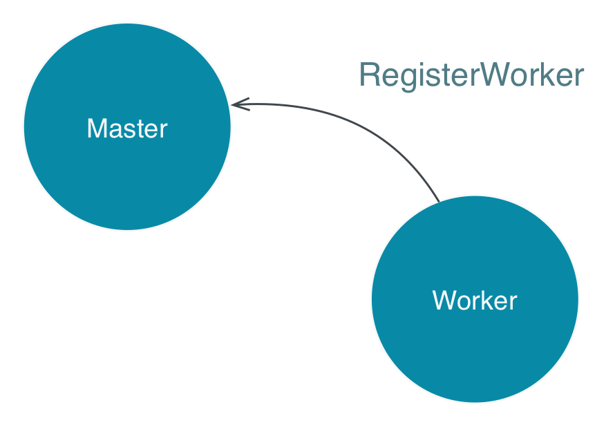
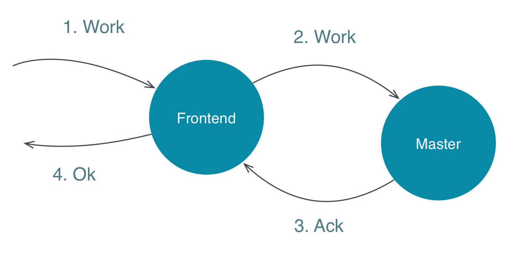

# The Worker

You can see how a worker is started in the method `startWorker`
in <a href="#code/src/main/scala/worker/Main.scala" class="shortcut">Main.scala</a>

Open <a href="#code/src/main/scala/worker/Worker.scala" class="shortcut">Worker.scala</a>.

The worker register itself periodically to the master, see the `registerTask`.
This has the nice characteristics that master and worker can be started in any order, and
in case of master fail over the worker re-register itself to the new master.

The Frontend actor sends the work to the master actor.

When the worker receives work from the master it delegates the actual processing to
a child actor, <a href="#code/src/main/scala/worker/WorkExecutor.scala" class="shortcut">WorkExecutor</a>,
to keep the worker responsive while executing the work.

